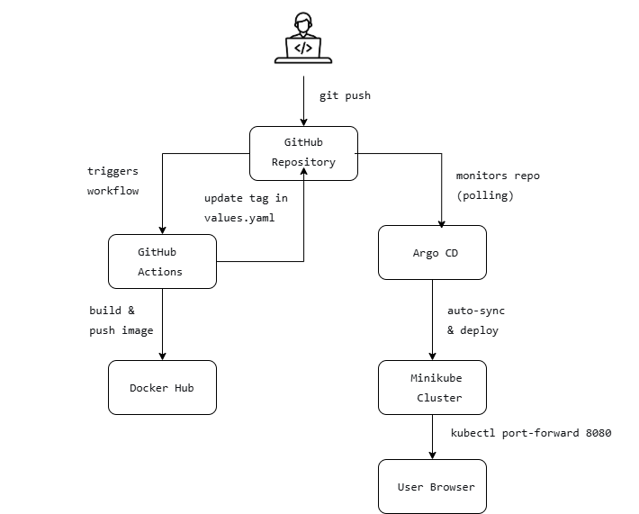

All tools are free and were installed on Windows without admin rights.

## Architecture Diagram



## How the GitOps Pipeline Works
1. **Developer pushes code** to `master` branch.
2. **GitHub Actions** builds a Docker image from `app/`, tags it with the short commit SHA and `latest`, logs in to Docker Hub, and pushes the image.
3. The workflow updates `helm/flask-app/values.yaml` with the new image tag and commits the change back to the repository.
4. **Argo CD** (configured with auto-sync) detects the change in the Helm chart, pulls the latest version from GitHub, and deploys the new image to the Minikube cluster.
5. The Flask app is updated without any manual intervention.

## Prerequisites (for local reproduction)
- Windows / Linux / macOS with Docker Desktop (or Docker Engine)
- Minikube installed
- kubectl installed
- Terraform installed
- Helm CLI installed
- A GitHub account
- A Docker Hub account

## Setup Instructions

### 1. Clone the Repository
```bash
git clone https://github.com/oshiokefred-collab/flask-time-app.git
cd flask-time-app
2. Start Minikube Cluster
bash
minikube start --driver=docker --kubernetes-version=1.30.0
Verify the cluster:

bash
kubectl get nodes
3. Deploy Argo CD with Terraform
Navigate to the terraform/ folder and apply:

bash
cd terraform
terraform init
terraform apply -auto-approve
This installs Argo CD in the argocd namespace using the official Helm chart (version 5.51.6).

Retrieve the admin password:

bash
kubectl -n argocd get secret argocd-initial-admin-secret -o jsonpath="{.data.password}" | base64 -d ; echo
Port-forward the dashboard:

bash
kubectl port-forward svc/argocd-server -n argocd 8081:443
Login at https://localhost:8081 with user admin and the password.

4. Configure GitHub Secrets
In your GitHub repository, add the following secrets (Settings → Secrets and variables → Actions):

DOCKER_USERNAME – your Docker Hub username (spygee)

DOCKER_PASSWORD – a Docker Hub access token with read/write permissions

Also enable Read and write permissions for GitHub Actions under Settings → Actions → General → Workflow permissions.

5. Apply the Argo CD Application
bash
kubectl apply -f argocd/application.yaml
This tells Argo CD to monitor the helm/flask-app path on the master branch and auto-sync.

6. Trigger the CI/CD Pipeline
Make a small change (e.g., edit app/app.py and commit):

bash
git add .
git commit -m "Update time format"
git push origin master
The GitHub Actions workflow will run, build the image, push it to Docker Hub, and update the Helm chart. Argo CD will then deploy the new version.

7. Test the App
bash
kubectl port-forward svc/flask-app 8080:8080
Open http://localhost:8080 – you should see the current time.

Screenshots
1. Deployed Application (updated time format)
https://screenshots/app_output.png

2. Argo CD Dashboard – Application Synced and Healthy
https://screenshots/argocd_dashboard.png

3. Updated Helm Chart values.yaml with Commit SHA
https://screenshots/helm_values_tag.png

4. GitHub Actions – Successful Pipeline Run
https://screenshots/github_actions_run.png

5. Docker Hub – Image Tagged with Commit SHA
https://screenshots/dockerhub_image.png

6. Kubernetes Pod Running with Correct Image
https://screenshots/kubectl_pod_image.png

(Additional screenshot: old_time_format.png shows the original time format before the update.)

Challenges & Solutions
Terraform Minikube provider hung – Started the cluster manually with minikube start and used Terraform only for Argo CD.

Empty kubeconfig – Deleted the file and restarted Minikube to regenerate it.

Docker Hub token lacked push access – Created a new token with read/write privileges.

Git merge conflicts – Pulled remote changes before pushing, completed a merge commit.

Port-forward conflict – Killed the old process using netstat and taskkill.

Future Improvements (as highlighted in the tutor’s notes)
Add automated tests (unit, linting) before the build step.

Use a remote Terraform state backend (e.g., S3, Terraform Cloud).

Introduce manual approval gates in the pipeline.

Scan Docker images for vulnerabilities.

Use a production-grade Kubernetes distribution.